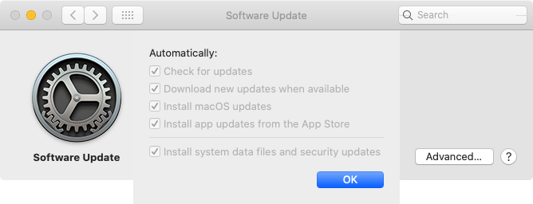

On macOS Catalina and later, this management profile enables the following options for Apple's software updates:

* Automatic background check for macOS software updates
* Automatic download of macOS software updates
* Automatic download and installation of XProtect, MRT and Gatekeeper updates
* Automatic download and installation of automatic security updates
* Automatic installation of macOS updates
* Automatic installation of App Store updates

