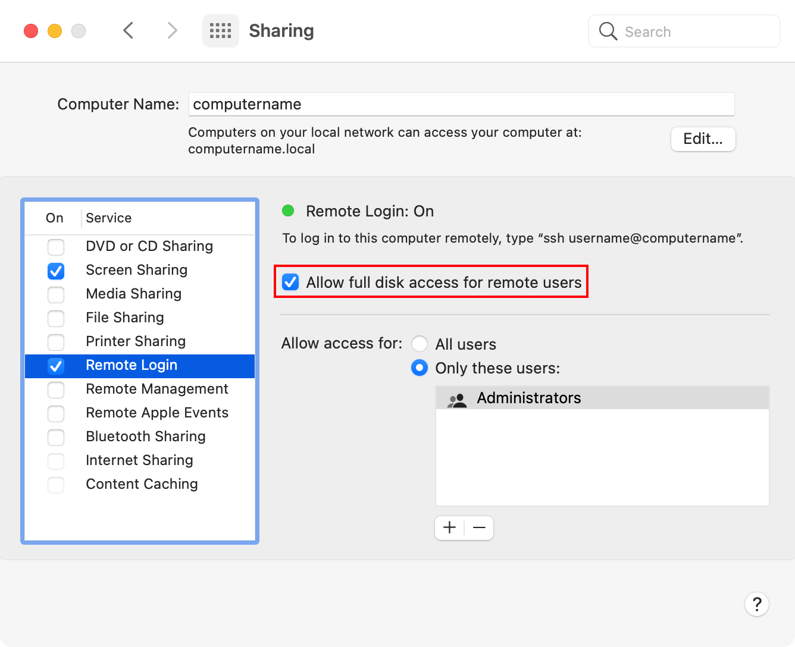

This management profile enables full disk access for SSH connections on macOS 11.4.0 and later. 

It manages the following settings:

* Enables the `Allow full disk access for remote users` checkbox in the `Remote Login` settings in `System Preference`'s `Sharing` preference pane
* Enables full disk access for `/usr/libexec/sshd-keygen-wrapper`

Note: Profile deployment requires: 

1. User Approved Mobile Device Management (UAMDM) to be enabled on the target Mac.
1. Profile must be installed by an MDM server.

For more information on full disk access, please see the links below:

* [https://support.apple.com/guide/mdm/user-approved-payloads-mdm54d0374ba/web](https://support.apple.com/guide/mdm/user-approved-payloads-mdm54d0374ba/web)
* [https://macpaw.com/how-to/full-disk-access-mojave](https://macpaw.com/how-to/full-disk-access-mojave)
* [https://support.apple.com/guide/mdm/privacy-preferences-policy-control-payload-mdm38df53c2a/web](https://macpaw.com/how-to/full-disk-access-mojave)

Hat tip to [poundbangbash](https://github.com/poundbangbash) for providing the correct PPPC settings for SSH full disk access by allowing full disk access to `/usr/libexec/sshd-keygen-wrapper`.

